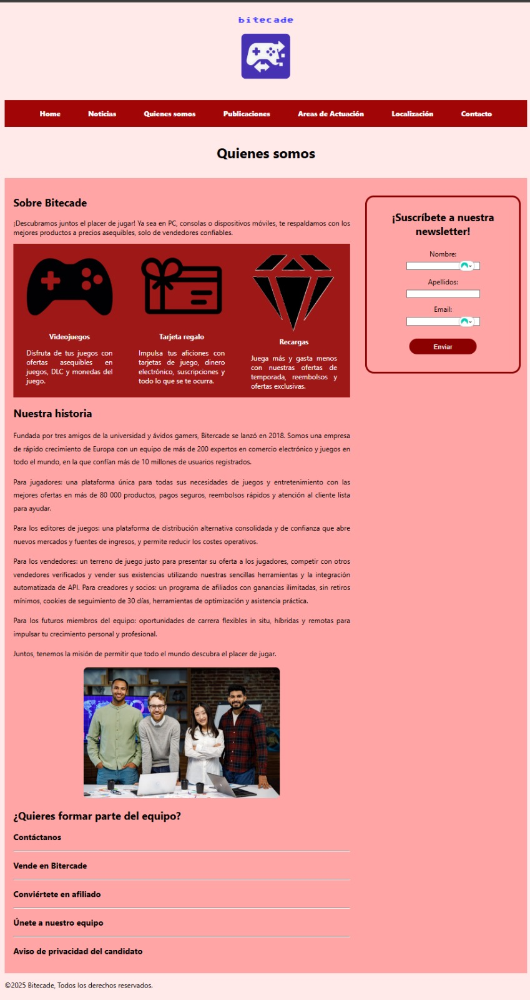

# 
 Desarrollo de Página Web Corporativa: Empresa X

## Indice
1. [Caracteristicas](#1-caracteristicas).
2. [Tecnologias utilizadas](#2-tecnologias-utilizadas).
3. [Estructura del sitio](#3-estructura-del-sitio).
4. [Instalación y uso](#4-instalacion-y-uso).
5. [Capturas de pantalla](#5-capturas-de-pantalla).
6. [Equipo de desarrollo](#6-equipo-de-desarrollo).

---
## 1. Caracteristicas

Somos una empresa de venta de productos físicos y digitales relacionada con el mundo de los videojuegos. Vendemos consolas nuevas y de segunda mano, claves digitales para videojuegos en diferentes plataformas y ofrecemos publicidad y noticias de actualidad referentes a la industria del videojuego

**División del trabajo**

**Álvaro:** Estructura proyecto, estructura javascript y contacto.

**Diego:** áreas de actuación y noticias (incluye inscripción  newsletter).

**Javier:** home y quienes somos. 
 

---
## 2. Tecnologias utilizadas

---
## 3. Estructura del sitio
***En construcción***
| Principal | Subcarpeta | Descripción |
|----------|------------|-------------|
| Enunciado | | Contiene el enunciado del ejercicio |
|  | [Actividad 3_Web Corporativa HTML y CSS Responsive.pdf](Enunciado/Actividad%203_Web%20Corporativa%20HTML%20y%20CSS%20Responsive.pdf) | Enunciado ejercicio |
| css | | Contiene los estilos de las páginas |
|  | [about.css](css/about.css) | Estilo de acerca de |
|  | [areasActuacion.css](css/areasActuacion.css) | Estilo de Áreas de actuación |
|  | [base.css](css/base.css) | Estilo base para todas las páginas y responsive |
|  | [contacto.css](css/contacto.css) | Estilo de contacto |
|  | [localizacion.css](css/localizacion.css) | Estilo de localización |
|  | [noticias.css](css/noticias.css) | Estilo de noticias |
|  | [publicaciones.css](css/publicaciones.css) | Estilo de publicaciones |
|  | [README.md](css/README.md) | El README del proyecto |
|  | [index.html](index.html) | Página principal |
|  | [script.js](script.js) | JavaScript de la página principal |
|  | [style.css](style.css) | Estilo de la página principal |
| fonts | | Contiene las fuentes |
|  | [Sixtyfour-Regular-VariableFont_BLED,SCAN.ttf](fonts/Sixtyfour-Regular-VariableFont_BLED,SCAN.ttf) | Fuente utilizada |
| html | | Contiene las páginas secundarias |
|  | [about.html](html/about.html) | Página Acerca de |
|  | [areasActuacion.html](html/areasActuacion.html) | Página Áreas de actuación |
|  | [contacto.html](html/contacto.html) | Página de contacto |
|  | [localizacion.html](html/localizacion.html) | Página de localización |
|  | [noticias.html](html/noticias.html) | Página de noticias |
|  | [publicaciones.html](html/publicaciones.html) | Página de publicaciones |
| img | | Contiene las imágenes del proyecto |
|  | [capturas](img/capturas) | Contiene capturas del proyecto |
|  | [logo_bitecade.png](img/logo_bitecade.png) | Logo en PNG |
|  | [logo_bitecade.svg](img/logo_bitecade.svg) | Logo en SVG |
| js | | Contiene los JavaScript de las páginas |
|  | [about.js](js/about.js) | JavaScript de "Sobre nosotros" |
|  | [areasActuacion.js](js/areasActuacion.js) | JavaScript de "Áreas de actuación" |
|  | [base.js](js/base.js) | Estructura básica de la página |
|  | [contacto.js](js/contacto.js) | JavaScript de contacto |
|  | [localizacion.js](js/localizacion.js) | JavaScript de localización |
|  | [navPrincipal.js](js/navPrincipal.js) | Cabecera de la página principal |
|  | [navSecundario.js](js/navSecundario.js) | Cabecera de la página secundaria |
|  | [noticias.js](js/noticias.js) | JavaScript de noticias |
|  | [publicaciones.js](js/publicaciones.js) | JavaScript de publicaciones |

---
## 4. Instalacion y uso

Sigue estos pasos para clonar y ejecutar el proyecto localmente:

Abre tu terminal y ejecuta:

git clone git@github.com:apy122/TrabajoGrupal_LLMM_Grupo11.git

---
## 5. Capturas de pantalla

### ***Menús***

#### **Menú en grande**

#### **Menú en pequeño**

### ***Home***

#### **Home en grande**

#### **Home en pequeño**

### ***Noticias***

#### **Noticias en grande**

#### **Noticias en pequeño**

### ***Quien somos***

#### **Quien somos en grande**

#### **Quien somos en pequeño**

### ***Contacto***

#### **Contacto en grande**

#### **Contacto en pequeño**

---
## 6. Equipo de desarrollo

- **Álvaro Jesús Pérez Yuguero**  
  GitHub: [@apy122](https://github.com/apy122)
- **Diego Sainz Grandes**  
  Github: [Diesainzg](https://github.com/Diesainzg).
- **Javier Calvo Hidalgo**  
  Github: [Jacahi98 ](https://github.com/Jacahi98).  

  ---
